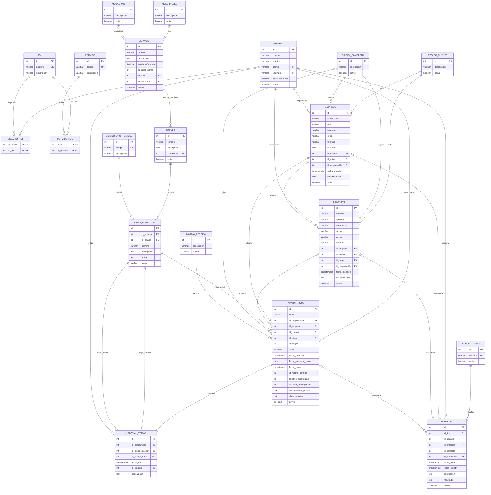

# Diseño funcional y modelo de datos de la segunda entrega

> **Estado:** decisiones de diseño acordadas; no constituye una descripción de funcionalidades ya implementadas.
>
> **Fecha de consolidación:** 25 de septiembre de 2026.
>
> **Propósito:** ser la referencia funcional del próximo incremento del CRM de la academia. Define el modelo E-R, el circuito comercial, sus excepciones y las decisiones que el frontend y el backend deben respetar. No es un plan técnico de implementación.

## 1. Cómo utilizar este documento

Este documento consolida las decisiones finales de la conversación de diseño. Las propuestas iniciales fueron revisadas: no deben recuperarse reglas descartadas solamente porque aparezcan en un plan anterior, en el código de la primera entrega o en documentación previa.

- Para el **comportamiento objetivo de la segunda entrega**, esta es la referencia funcional acordada.
- [Modelo de dominio anterior](modelo-dominio.md), [documentación de la primera entrega](entrega-1.md) y [contratos anteriores](api-frontend.md) sirven como contexto del estado previo. No reemplazan estas decisiones.
- El enunciado sigue siendo la referencia de los requisitos académicos. Las simplificaciones y limitaciones adoptadas aquí se declaran expresamente; no se presentan como requisitos textuales de la profesora.
- Los futuros agentes deben implementar el comportamiento indicado, no volver a decidir las reglas funcionales ni incorporar mejoras futuras como si estuvieran aprobadas.
- Una decisión técnica posterior —por ejemplo, rutas HTTP, autenticación, organización de archivos o mecanismo de persistencia— no debe alterar estas reglas.

### 1.1. Fuentes y alcance

Se analizaron las cuatro consignas:

- [Consigna del trabajo práctico](../Enunciado/Consigna_Trabajo_Practico.pdf): alcance, roles y especialización del CRM; especialmente páginas 4–6.
- [Definiciones generales](../Enunciado/Definiciones-Generales.pdf): entidades, conservación del historial y reglas generales; especialmente páginas 2–5.
- [Módulos principales](../Enunciado/Modulos_Principales.pdf): clientes, oportunidades, etapas, actividades e historial; páginas 1–7.
- [Entregas CRM](../Enunciado/Entregas-CRM.pdf): diferencia entre primera entrega y entrega final; páginas 2–3.

También se tomó la aclaración transmitida por el usuario: una oportunidad se organiza mediante un embudo; deja de tener una relación directa con servicios o líneas de servicios.

La primera entrega ya existe. Sus datos son de prueba y se puede reconstruir la base cuando se implemente el nuevo modelo. **No hace falta desarrollar una migración de los datos actuales.** Este acuerdo no autoriza a reconstruir bases automáticamente ni afirma que ya se haya realizado alguna modificación.

### 1.2. Objetivo de producto

La oportunidad debe ser **ligera, rápida de crear y fácil de visualizar**. El usuario realiza la menor cantidad de selecciones posible y completa información adicional durante la negociación.

La especialización en academia se expresa en servicios, niveles de inglés, modalidades y datos de la contratación. No se convierte el CRM en un sistema de alumnos, cursadas, asistencia, matrículas, facturación o pagos.

## 2. Decisiones esenciales

| Tema | Decisión final |
|---|---|
| Servicio por embudo | Cada embudo corresponde a un único servicio. Un servicio puede tener varios embudos. |
| Relación de oportunidad | La oportunidad referencia su etapa actual. Desde ella se obtienen embudo, servicio y estado. |
| Etapas finales | Cada embudo tiene exactamente una ganada y una perdida, creadas automáticamente. |
| Etapas abiertas | Son configurables. No se exige un recorrido completo al crear el embudo. |
| Estado | `ABIERTA`, `GANADA` y `PERDIDA` son códigos fijos, únicos y no personalizables. |
| Alta rápida | Responsable por defecto: creador. Etapa por defecto: primera abierta y activa del embudo. |
| Importe | Un único campo `valor`, total de la negociación. Si se omite al crear, se copia el precio de referencia del servicio. |
| Origen | Opcional en empresa, contacto y oportunidad. |
| Relaciones históricas | Cambiar la empresa de un contacto no modifica oportunidades ni actividades existentes. Solo se informa al usuario. |
| Edición de cerradas | Para corregir los datos comerciales de una oportunidad cerrada, primero debe reabrirse con autorización. |
| Baja de cerradas | Puede darse de baja directamente, sin reapertura ni cambio de etapa. |
| Historial | Registra alta y cambios de etapa. La observación de reapertura conserva en texto los datos del cierre anterior y la justificación. |
| Baja lógica de datos | Empresa, contacto, oportunidad y actividad: definitiva, sin restauración. Los registros permanecen almacenados. |
| Baja de configuración | Usuario, servicio, embudo, etapas abiertas y catálogos configurables: reversible. |
| Sin cascadas | Desactivar un registro no desactiva ni modifica automáticamente sus relaciones. |
| Simplicidad aceptada | Usuarios desactivados pueden conservar asignaciones; no hay log genérico, copias JSON ni auditoría de cada edición. |

## 3. Modelo E-R acordado

El diagrama representa las entidades y relaciones del diseño objetivo. Los tipos son orientativos; tamaños, mecanismos de autenticación, contratos y otros detalles técnicos se definirán al planificar la implementación.

- `||` indica exactamente uno; `o|`, cero o uno; `o{`, cero o muchos; `|{`, uno o muchos.
- Una FK opcional no vuelve opcional al conjunto: en oportunidad y actividad se exige al menos empresa o contacto.
- La presencia de un atributo no significa que deba pedirse ni completarse manualmente en el alta.
- La obligatoriedad condicional del motivo y de la fecha de cierre se describe en las reglas, no mediante la cardinalidad aislada.
- Las dos etapas finales por embudo son una restricción adicional que una cardinalidad general no expresa.

### 3.1. Lectura del modelo

El núcleo es `OPORTUNIDAD → ETAPA_COMERCIAL → EMBUDO → SERVICIO`. El estado se obtiene por `OPORTUNIDAD → ETAPA_COMERCIAL → ESTADO_OPORTUNIDAD`.

La oportunidad **no almacena** `id_embudo`, `id_servicio` ni `id_estado`. Seleccionar un embudo en pantalla no obliga a persistir esa selección por duplicado: queda determinado por la etapa asignada.

Empresa y contacto sí permanecen como relaciones independientes de oportunidad. Una negociación puede ser corporativa sin persona identificada, individual sin empresa, o corporativa con un interlocutor. Además, la empresa de una negociación anterior no debe cambiar porque el contacto cambie de empleo.

Empresa, contacto y oportunidad tienen responsables propios. No se exige que coincidan: el responsable de una cartera puede ser distinto del responsable de una negociación concreta.

`TIPO_ACTIVIDAD` es el catálogo; `ACTIVIDAD` es el hecho ocurrido. Se elimina la ambigüedad del modelo previo, donde el nombre actividad se utilizaba con dos significados.

Se usa `MOTIVO_PERDIDA` en lugar de `MOTIVO_RECHAZO`: una pérdida puede deberse a falta de respuesta, horarios o presupuesto, sin un rechazo explícito.

No hay líneas de oportunidad, log genérico, tabla adicional de historial comercial, versiones de etapas ni copias JSON. El historial comercial se presenta a partir de los hechos y transiciones existentes.

## 4. Estado comercial, disponibilidad y baja lógica

### 4.1. No confundir `activo` con abierta

`activo` significa exclusivamente que el registro no está dado de baja lógica. No representa la situación de una negociación.

| Estado derivado | `activo` | Interpretación |
|---|---|---|
| Abierta | `true` | Negociación vigente y en curso. |
| Ganada o perdida | `true` | Negociación cerrada que permanece en la gestión y consulta habituales. |
| Cualquiera | `false` | Oportunidad dada de baja definitivamente; no participa de la operación habitual. |

Una oportunidad ganada no se desactiva automáticamente. Una baja lógica tampoco la vuelve ganada o perdida.

Los estados de cliente —por ejemplo, Potencial, Cliente, Inactivo y No contactar— son independientes de `activo`. Un cliente comercialmente inactivo puede seguir registrado con `activo=true`. Darlo de baja es otra acción.

### 4.2. Dos políticas de recuperación

**Datos de negocio:** empresa, contacto, oportunidad y actividad se dan de baja definitivamente. No se restauran, pero tampoco se eliminan físicamente. Su permanencia permite conservar referencias e información histórica; no obliga a ofrecer una pantalla de restauración ni una vista especial de registros eliminados.

**Configuración:** usuario, servicio, embudo, etapas abiertas y catálogos configurables pueden desactivarse y reactivarse. Las asociaciones existentes no se destruyen.

Excepciones expresas:

- Las etapas ganada y perdida de un embudo no pueden desactivarse individualmente.
- Los tres estados de oportunidad son fijos; no se administran como opciones desactivables.
- El historial de etapas no tiene baja lógica ni restauración: sus entradas se conservan.

No se incorporan nuevas operaciones de baja para roles o permisos por analogía. Sus tablas conservan la estructura del modelo; este acuerdo no define un ciclo adicional de eliminación para ellas.

### 4.3. No hay propagación automática

Desactivar una configuración o un dato no desactiva, elimina, reasigna ni vacía sus relaciones. Reactivar configuración tampoco reactiva otros registros.

Una actividad conserva su propio estado aunque se dé de baja una empresa, contacto u oportunidad asociados. Puede seguir apareciendo en el historial de otros registros vigentes relacionados. Las actividades no bloquean esas bajas.

Una actividad que recibe **su propia baja** deja de aparecer en la interfaz habitual, sin mostrar una tarjeta de “actividad eliminada”. No se exige registrar un autor o fecha de baja adicionales ni generar un log por esta operación.

## 5. Configuración de servicios, embudos y etapas

### 5.1. Un servicio por embudo

Cada embudo tiene exactamente un servicio. Un servicio puede utilizarse en varios embudos, por ejemplo para organizar procesos comerciales diferentes.

Una vez utilizado por oportunidades, el embudo conserva su servicio. Cambiar esa relación reinterpretaría las negociaciones anteriores. Si se necesita otro proceso asociado a otro servicio, se crea otro embudo.

Se puede actualizar el precio de referencia del servicio sin modificar el `valor` de oportunidades existentes.

### 5.2. Disponibilidad por uso directo

Los tres indicadores `activo` cumplen funciones distintas y no son tres interruptores que deban consultarse en cadena para cualquier operación.

| Registro desactivado | Lo que deja de permitirse | Lo que se conserva |
|---|---|---|
| Servicio | Seleccionarlo para crear un nuevo embudo. | Los embudos existentes activos pueden seguir recibiendo oportunidades y utilizándolo. |
| Embudo | Seleccionarlo para crear oportunidades o reabrir oportunidades dentro de él. | Sus etapas y oportunidades conservan relaciones y estados. |
| Etapa abierta | Seleccionarla como etapa inicial o destino de movimiento/reapertura. | Sus referencias históricas. |
| Otras opciones de catálogo | Elegirlas para nuevas asignaciones. | La lectura de registros que ya las tenían asociadas. |

**Ejemplo:** desactivar el servicio “Inglés B1” no cierra ni desactiva el embudo “Inscripciones B1”. Si este último sigue activo, todavía puede recibir oportunidades. Para retirar ese proceso se desactiva expresamente el embudo.

La regla del servicio sustituye la propuesta anterior de bloquear nuevas oportunidades cuando su servicio estuviera desactivado.

### 5.3. Dos finales únicas y permanentes

Al crear un embudo se crean automáticamente:

1. Una etapa de estado `GANADA`, inicialmente denominada “Ganada”.
2. Una etapa de estado `PERDIDA`, inicialmente denominada “Perdida”.

Son exactamente una de cada estado, no simplemente “al menos una”.

- Se pueden editar nombre y descripción; por ejemplo, “Ganada” puede llamarse “Inscripción confirmada”.
- No se puede cambiar su estado, eliminarlas, desactivarlas ni crear otras etapas del mismo estado dentro de ese embudo.
- Permanecen activas aunque se desactive el embudo. Eso no habilita a operar sobre un embudo desactivado.
- Los motivos de pérdida describen las distintas razones del cierre; no se crean etapas distintas para “Precio”, “Horarios” o “Falta de respuesta”.
- La acción de ganar o perder tiene un único destino posible dentro del embudo.

Esta decisión reemplaza tanto la propuesta de permitir finales desactivables como la alternativa de tener varias finales y bloquear su desactivación según las asociaciones.

### 5.4. Etapas abiertas y estabilidad histórica

Las etapas abiertas se crean y configuran según el proceso de la academia. Una etapa ya utilizada por oportunidades o por el historial conserva su embudo y su significado de estado. No se reutiliza para representar otra cosa. Se pueden corregir sus textos y cambiar su orden.

Las oportunidades no cambian de embudo después de creadas. Todo movimiento y reapertura selecciona una etapa del embudo determinado por su etapa actual.

No se exige avanzar por todos los pasos ni seguir exclusivamente un sentido ascendente. La etapa actual expresa dónde está la negociación; el historial conserva el recorrido realizado.

### 5.5. Orden y reactivación

- El orden solo debe ser único **entre etapas activas del mismo embudo**, incluidas las finales.
- Puede repetirse entre embudos diferentes y entre registros inactivos.
- No es necesario que los números sean consecutivos.
- Al reactivar una etapa abierta, se la coloca al final: mayor orden entre las etapas activas más uno; si no hubiera ninguna, 1.
- La posición anterior de una etapa desactivada no queda reservada.
- El selector de destinos ofrece etapas activas. Una relación histórica sigue mostrando su etapa aunque esta esté desactivada.

La restricción corresponde a una unicidad condicional de `(id_embudo, orden)` para etapas activas, no a una unicidad global que incluya las dadas de baja. La forma técnica de materializarla se resolverá en implementación.

### 5.6. Configuración incompleta permitida

No se agrega una validación general que exija un recorrido comercial completo antes de guardar un embudo. Las dos etapas finales existen automáticamente por la decisión anterior, pero el usuario puede no haber creado todavía ninguna etapa abierta.

En ese caso, el embudo se puede guardar; crear una oportunidad dentro de él no se puede completar hasta que exista una etapa abierta activa. La interfaz explica qué falta.

Validar preventivamente recorridos, ofrecer asistentes de configuración o mostrar recomendaciones al gestionar embudos son mejoras futuras. No deben convertirse en nuevas restricciones de negocio sin otro acuerdo.

### 5.7. Qué impide desactivar un embudo o etapa abierta

- **Embudo:** lo bloquea tener al menos una oportunidad abierta con `activo=true` en cualquiera de sus etapas.
- **Etapa abierta:** lo bloquea tener al menos una oportunidad abierta con `activo=true` situada en ella.
- Las oportunidades ganadas o perdidas no bloquean la desactivación del embudo.
- Las oportunidades con `activo=false` no bloquean ninguna de esas dos bajas, aunque su estado derivado sea abierto. No se restauran y conservan sus referencias.
- Una etapa final no llega a esta evaluación: su desactivación está prohibida por definición.

## 6. Circuito de una oportunidad

### 6.1. Crear con la menor fricción posible

1. El usuario parte del detalle de un cliente, de un embudo o del listado de oportunidades.
2. La interfaz aprovecha ese contexto para completar cliente y/o embudo, sin exigir que se vuelvan a seleccionar.
3. Al seleccionar el embudo se asigna su primera etapa **abierta y activa**, según `orden`. No se toma simplemente la primera etapa si esta fuera ganada o perdida.
4. El responsable inicial es el usuario que crea la oportunidad.
5. Se completa un título y se confirma el alta. Los datos complementarios pueden editarse luego.
6. Se genera la fecha de creación y una entrada inicial en el historial.

| Información | Regla en el alta |
|---|---|
| Título | Necesario para identificar la negociación. Se puede sugerir desde el contexto; no obliga a un formato especial. |
| Empresa y contacto | Al menos uno. Pueden existir ambos. No exigir una empresa a un cliente individual. |
| Responsable | Obligatorio, preseleccionado con el creador. |
| Embudo | Selección de contexto que determina las etapas disponibles; no se duplica como FK en oportunidad. |
| Etapa | Obligatoria; primera abierta activa por defecto. |
| Estado y servicio | Derivados de la etapa y su embudo. No se solicitan por separado. |
| Fecha de creación | Automática. |
| `activo` | Verdadero al crear. No es una selección comercial del formulario. |
| `valor` | Puede omitirse en la entrada; se completa con el precio de referencia del servicio. |
| Origen | Opcional. No exigir un origen ficticio para continuar. |
| Fecha estimada de cierre | Opcional. |
| Objetivo, participantes, disponibilidad y observaciones | Opcionales. |
| Fecha de cierre y motivo de pérdida | No se piden en el alta abierta; corresponden al cierre. |

Las referencias seleccionadas para nuevas asociaciones deben estar disponibles. No se ofrecen empresas ni contactos dados de baja como nuevos clientes. Esto no impide leer referencias anteriores a esos registros.

### 6.2. Datos específicos de academia

Se agregan únicamente estos tres campos opcionales a oportunidad:

| Campo | Significado y ejemplos |
|---|---|
| `objetivo_aprendizaje` | Qué busca esta contratación: conversación, viajes, trabajo, certificación o capacitación empresarial. Texto libre. |
| `cantidad_participantes` | Cuántas personas comprende la contratación. Si se informa, es un entero mayor que cero. No modifica automáticamente el importe. |
| `disponibilidad_horaria` | Condiciones que pueden determinar la viabilidad: noches, fines de semana, franja horaria, etc. Texto libre; no es una agenda. |

Pertenecen a la oportunidad porque una misma persona o empresa puede tener contrataciones con objetivos y condiciones diferentes a lo largo del tiempo.

No se agregan catálogos de objetivos ni tablas de alumnos, evaluaciones o participantes. Tampoco se agrega un nivel actual del alumno al contacto: este puede ser un interlocutor empresarial y una oportunidad puede comprender participantes de diferentes niveles.

Nivel de inglés, modalidad y duración siguen describiendo el servicio. No se duplican como selecciones independientes de la oportunidad. La información adicional sobre evaluación o niveles heterogéneos puede expresarse en observaciones y actividades.

Se decidió no incluir sitio web de empresa en esta versión, aunque figure como dato “si corresponde” en el enunciado. Se priorizan los datos propios de la contratación de la academia.

### 6.3. Un solo importe

`valor` es el **importe total de la negociación**, no un precio por participante ni una cantidad a multiplicar.

- Si el usuario lo informa al crear, se conserva ese valor.
- Si lo omite, se copia `SERVICIO.precio_referencia`, obtenido a través de etapa y embudo.
- Omitir el importe es distinto de ingresar explícitamente cero.
- La copia se realiza al crear; no es un cálculo permanente. Un cambio posterior de precio del servicio no actualiza oportunidades existentes.
- Mientras la oportunidad está abierta, representa la estimación vigente.
- Al ganarla, se confirma o corrige y representa el total acordado.
- Al perderla, puede conservar la última estimación; eso no la convierte en una venta.
- No se separan `valor_estimado` y `valor_final`, ni se incorporan cantidades, descuentos o precios de líneas.

El precio de referencia es una propuesta inicial del importe. No se incorpora una fórmula comercial que dependa de duración, nivel, modalidad o cantidad de participantes.

### 6.4. Editar y cambiar de etapa

Una oportunidad abierta y no dada de baja permite completar o corregir sus datos. Estado, servicio y embudo no se editan como campos independientes.

Para moverla, se elige una etapa activa del mismo embudo. Si la elegida es una final, se aplican las reglas del cierre. Un cambio efectivo genera una entrada de historial con etapa anterior, nueva etapa, autor, fecha y observación cuando corresponda.

La nueva etapa y su entrada de historial deben quedar registradas como una sola operación funcional: no debe aparecer un movimiento confirmado sin historia ni una historia de un movimiento que no ocurrió. Seleccionar la etapa actual no representa un cambio nuevo.

### 6.5. Cerrar

| Resultado | Destino | Información necesaria |
|---|---|---|
| Ganada | Única etapa de estado `GANADA` del embudo. | Fecha real de cierre y `valor` total acordado. |
| Perdida | Única etapa de estado `PERDIDA` del embudo. | Fecha real de cierre y motivo de pérdida. Se conserva `valor` como última estimación. |

El cierre no da de baja la oportunidad. Se mantiene `activo=true` y continúa disponible para consulta.

Los motivos de pérdida son opciones configurables. En un nuevo cierre se selecciona una opción activa; una opción desactivada sigue siendo legible en oportunidades que ya la referencian.

Para corregir datos comerciales de una oportunidad cerrada o cambiar su resultado, primero debe reabrirse con autorización. No se cambia directamente de ganada a perdida o viceversa.

### 6.6. Reabrir

Condiciones acordadas:

- La oportunidad está ganada o perdida y tiene `activo=true`.
- El usuario tiene autorización para reabrir. El mecanismo concreto de permisos se definirá en la implementación; no se elimina este requisito.
- El embudo está activo. Si está desactivado, primero debe reactivarse.
- El usuario elige una etapa abierta y activa del mismo embudo. No necesariamente debe volver a la primera.
- Se aporta una justificación, incorporada al final de la observación automática.

No se exige que el servicio esté activo si el embudo existente está activo. Tampoco se exige que el responsable actual de la oportunidad esté habilitado: se acepta expresamente reabrir conservando un responsable desactivado.

Al reabrir:

1. Se capturan los datos del cierre anterior para componer la observación.
2. Se registra la transición desde la etapa final hacia la abierta elegida.
3. Se limpia la fecha de cierre actual y el motivo de pérdida actual.
4. Se conserva `valor` como punto de partida de la negociación reabierta; se puede corregir después.
5. La oportunidad sigue vigente y ahora su estado derivado es abierto.

La autorización corresponde al usuario que realiza la reapertura autorizada. No se agrega un circuito separado de solicitud y aprobación ni otro campo de aprobador.

### 6.7. Observación automática de reapertura

Se usa el campo `observacion` del historial, sin nuevas columnas ni copias JSON.

El sistema incorpora una base que identifica el cierre anterior: resultado, fecha, importe y motivo de pérdida cuando corresponda. Al final agrega la justificación escrita por el usuario autorizado. No se deja la conservación de esos datos librada a que alguien recuerde escribirlos manualmente.

Ejemplos orientativos de texto, no formatos técnicos obligatorios:

> Reapertura. Cierre anterior: ganada; fecha: 24/09/2026; valor: $100.000. Justificación: el cliente solicitó ajustar la propuesta.

> Reapertura. Cierre anterior: perdida; fecha: 24/09/2026; valor: $80.000; motivo: horarios incompatibles. Justificación: se abrió un horario compatible con su disponibilidad.

El autor y la fecha de la reapertura están en los campos normales del historial. Una segunda reapertura genera otra entrada: no reemplaza la observación anterior.

### 6.8. Dar de baja una oportunidad

Una oportunidad puede darse de baja estando abierta, ganada o perdida.

- Una cerrada se da de baja **directamente**, sin reabrirla.
- La baja solo cambia su disponibilidad: no altera etapa, resultado, cliente, importe ni datos de cierre.
- No genera una transición artificial en el historial de etapas.
- No se restaura después.
- No bloquea desactivaciones por su estado abierto, porque `activo=false` la excluye de la operación.
- Sus actividades conservan su propio estado. No se eliminan en cascada.

## 7. Empresas, contactos y asociaciones históricas

### 7.1. Separación de conceptos

Una empresa representa una organización; un contacto representa una persona. Ambos pueden existir sin negociaciones abiertas. La oportunidad representa una contratación concreta y tiene su propio responsable.

Una oportunidad puede tener:

- Solo empresa: contratación corporativa sin interlocutor identificado.
- Solo contacto: contratación individual.
- Empresa y contacto: contratación corporativa con persona de contacto.

No puede carecer de ambas referencias. Empresa y contacto no se eliminan del modelo por transitividad, porque describen roles diferentes y relaciones que pueden cambiar con el tiempo.

### 7.2. Cambiar o quitar la empresa de un contacto

**Solo cambia el contacto. No se actualiza ninguna oportunidad ni actividad existente.**

Esto aplica tanto a pasar de empresa A a B como de A a ninguna o de ninguna a una empresa. La interfaz muestra un aviso informativo y no ofrece una pregunta de actualización masiva.

Texto orientativo:

> Este cambio afecta únicamente a la empresa actual del contacto. Las oportunidades y actividades existentes conservarán sus asociaciones.

Se descartaron expresamente:

- Reasignar automáticamente las oportunidades a la empresa nueva.
- Vaciar la empresa de oportunidades anteriores.
- Ofrecer un Sí/No para actualizar oportunidades abiertas.
- Modificar actividades como consecuencia del cambio.

### 7.3. Compatibilidad al asociar, no igualdad permanente

Al crear una oportunidad o cambiar expresamente sus relaciones de empresa/contacto, la selección debe ser coherente con la asociación actual del contacto.

Una vez establecida, puede dejar de coincidir con la empresa actual del contacto sin que la oportunidad sea inválida. No se vuelve a imponer la coincidencia al editar su título, importe u otro dato ajeno a esa asociación.

**Ejemplo:** Ana participó de una contratación de Empresa A. Después pasa a Empresa B. La oportunidad conserva Empresa A y Ana; cambiar su título no debe rechazarse porque Ana ahora pertenezca a B.

“Conservar” o “congelar” la asociación no significa copiar todos los atributos del cliente. Corregir el nombre de una empresa puede reflejarse en sus referencias existentes. No se incorporan versiones históricas de nombres, correos o direcciones.

### 7.4. Origen y responsables

El origen es opcional en las tres entidades. El origen de una nueva negociación puede diferir del origen por el cual se conoció al cliente. No se deriva obligatoriamente ni se mantiene sincronizado.

Empresa y contacto conservan sus responsables propios. La oportunidad tiene otro responsable, inicialmente el creador. No se exige igualdad entre ellos ni reasignaciones en cadena.

### 7.5. Bajas de clientes

- Una empresa no puede darse de baja si tiene algún contacto con `activo=true` o alguna oportunidad directamente asociada con `activo=true`.
- Un contacto no puede darse de baja si tiene alguna oportunidad asociada con `activo=true`.
- Para este bloqueo, una oportunidad ganada o perdida cuenta igual que una abierta si sigue activa.
- Los contactos y oportunidades dados de baja no bloquean.
- Las actividades asociadas no bloquean.
- No se eliminan físicamente clientes, ni se vacían sus referencias históricas, ni se producen bajas en cascada.

La regla final es deliberadamente más sencilla que la primera propuesta: **en clientes se mira `activo` de la oportunidad, no su estado comercial**. En cambio, para embudos y etapas abiertas se miran ambas condiciones: abierta y activa.

## 8. Matriz de bajas y reactivaciones

| Entidad | ¿Qué impide la baja? | ¿Se reactiva? | Consecuencia principal |
|---|---|---|---|
| Empresa | Contactos activos o cualquier oportunidad activa asociados. | No. | Se retira de la gestión habitual; referencias y actividades se conservan. |
| Contacto | Cualquier oportunidad activa asociada. | No. | No modifica oportunidades ni actividades existentes. |
| Oportunidad | No se agrega un bloqueo por estar cerrada ni por tener actividades/historial. | No. | Conserva su estado comercial y deja de participar de la operación habitual. |
| Actividad | No se agrega un bloqueo por sus asociaciones. | No. | Deja de aparecer; no se exige mostrar un marcador de eliminación. |
| Usuario | Sus asignaciones no bloquean. | Sí. | Pierde acceso; continúa identificado como responsable o autor en referencias existentes. |
| Servicio | Sus embudos existentes no bloquean. | Sí. | No se elige en nuevos embudos; los existentes mantienen funcionamiento. |
| Embudo | Oportunidades abiertas y activas dentro de él. | Sí. | No recibe nuevas oportunidades ni reaperturas mientras esté desactivado. |
| Etapa abierta | Oportunidades abiertas y activas situadas en ella. | Sí, al final del orden activo. | No se ofrece como destino mientras esté desactivada. |
| Etapa ganada/perdida | No admite baja individual, tenga o no oportunidades. | No aplica. | Se retira el proceso desactivando el embudo. |
| Catálogo configurable | No se agrega un bloqueo por referencias existentes. | Sí. | No se selecciona para nuevas asociaciones; se siguen leyendo referencias existentes. |
| Estado de oportunidad | No admite bajas ni personalización de sus códigos. | No aplica. | Conserva el significado de abierta, ganada y perdida. |
| Historial de etapas | No admite eliminación o edición del historial. | No aplica. | Conserva cada evento registrado. |

Las operaciones siguen sujetas a los permisos del actor. “Sin bloqueo por asociaciones” no significa que cualquier usuario esté autorizado a ejecutarlas.

## 9. Actividades e historial comercial

### 9.1. Hechos ocurridos

Una actividad es una interacción ya realizada, no una tarea futura. Registra tipo, usuario que la cargó, fecha de ocurrencia, fecha de registro, descripción, resultado y relaciones comerciales.

- Debe tener empresa o contacto; puede tener ambos.
- Puede vincularse además a una oportunidad.
- Desde una oportunidad, la interfaz aprovecha sus asociaciones para evitar que el usuario repita selecciones.
- Una relación con oportunidad debe corresponder al contexto comercial de esa oportunidad. Para hechos históricos se respeta el contexto conservado, no se recalcula desde la empresa actual del contacto.
- Registrar una interacción posterior a un cierre no implica editar los datos de la oportunidad ni reabrirla: es una actividad independiente.

Se mantienen los tipos requeridos por el enunciado: llamada, correo electrónico, mensaje, reunión presencial, reunión virtual, demostración, envío de propuesta, nota interna y otro tipo configurable.

`fecha_hora` es el momento del hecho; `fecha_registro`, el momento en que se cargó. Una llamada de ayer cargada hoy conserva ambas fechas. La historia comercial se consulta cronológicamente según los hechos, sin confundir esas fechas.

### 9.2. Bajas y visibilidad

Dar de baja una actividad la oculta. No se agrega una señal de “actividad eliminada”, una obligación de reemplazarla por una nota ni un registro adicional de quién la eliminó.

Las actividades no son determinantes para impedir bajas de sus registros asociados. Si se da de baja un cliente u oportunidad, las actividades no cambian de `activo` por ese motivo y siguen disponibles desde otros registros vigentes relacionados, según los permisos aplicables.

No es necesario crear una pantalla especial para recuperar actividades cuyos únicos registros relacionados están dados de baja. La conservación en almacenamiento no equivale a una funcionalidad de restauración.

### 9.3. Alcance exacto del historial de etapas

Cada entrada identifica oportunidad, etapa anterior, etapa nueva, fecha/hora, autor y observación.

- Al crear se agrega una entrada con etapa anterior vacía y etapa nueva igual a la inicial.
- Después, cada cambio efectivo agrega otra entrada; no sobrescribe las anteriores.
- Cierre y reapertura son cambios de etapa y se registran de esa forma.
- No se agregan tipos de evento como nuevas columnas: el recorrido se reconoce por las etapas y observaciones.
- No registra cada edición de un campo mientras la oportunidad está abierta.
- No se utiliza para simular movimientos por una baja lógica.
- No se agregan notas internas automáticas por cada reasignación, edición o baja como sustituto de un log descartado.

La observación automática de reapertura conserva el cierre previo como texto legible. No se promete consultar o calcular estadísticamente importes históricos desde datos estructurados.

### 9.4. Límite frente al requisito general de auditoría

El enunciado pide registrar cambios de oportunidades cerradas e identificar autores de cambios importantes. La decisión adoptada cubre las correcciones comerciales mediante reapertura autorizada, conservación textual del cierre anterior y un nuevo cierre.

**No equivale a una auditoría completa de cada campo.** Tampoco se agrega auditoría específica de bajas. Esta limitación fue aceptada por simplicidad: no debe afirmarse que el historial registra toda modificación posible ni incorporarse un log por iniciativa del implementador para completar ese alcance.

Si más adelante se requiere trazabilidad completa, será una ampliación explícita del producto.

## 10. Usuarios, roles y permisos

Se conservan usuario, rol, permiso y sus relaciones muchos-a-muchos. Los tres perfiles del enunciado —administrador, vendedor y responsable comercial— continúan dentro del alcance de la segunda entrega.

- Los permisos se validan en el backend, no solo ocultando botones.
- El autor de una actividad o transición es el usuario autenticado que la realiza, no una elección libre del formulario.
- El responsable de una oportunidad puede ser distinto de quien realiza un movimiento.
- Desactivar un usuario no borra referencias ni exige reasignar primero su cartera.
- Se permite mantener una oportunidad abierta o reabrir una cerrada con responsable desactivado. Es una inconsistencia operativa aceptada para no entorpecer el circuito.
- Un usuario desactivado no puede operar personalmente; eso no impide que otro usuario autorizado gestione los registros asignados a él.
- Reasignar sigue siendo posible mediante las funciones de gestión y permisos correspondientes, pero no es un requisito previo impuesto por la desactivación.
- Las contraseñas deben almacenarse de forma segura según el enunciado.

Este diseño no aprueba la matriz detallada de permisos ni los detalles de tokens propuestos en un plan anterior. Deben planificarse después respetando el enunciado y estas reglas, especialmente la autorización para reabrir.

## 11. Comportamientos que la interfaz debe conservar

Esta sección documenta decisiones de interacción. No son sugerencias opcionales de estilo.

| Situación | Comportamiento esperado |
|---|---|
| Alta desde un cliente o embudo | Aprovechar el contexto; no pedir de nuevo información conocida. |
| Seleccionar embudo | Elegir por defecto la primera etapa abierta y activa. No pedir estado ni servicio aparte. |
| Responsable en el alta | Preseleccionar al creador. No agregar una selección obligatoria adicional. |
| Importe omitido | Usar el precio de referencia como valor inicial; mostrar el valor resultante de manera comprensible. |
| Campos de academia y otros opcionales | No bloquear el alta por faltar objetivo, participantes, disponibilidad, origen, fecha estimada u observaciones. |
| Embudo sin etapas abiertas activas | Explicar que falta configurar una etapa abierta; no crear la oportunidad en una etapa final ni inventar una abierta. |
| Ganar o perder | Resolver la única etapa final correspondiente; solicitar los datos de cierre necesarios. |
| Editar datos de una cerrada | Indicar que necesita reapertura autorizada. La baja directa es una excepción separada. |
| Reabrir con embudo desactivado | Indicar que primero debe reactivarse; no hacerlo automáticamente. |
| Reabrir | Ofrecer etapas abiertas activas del mismo embudo y pedir justificación; conservar automáticamente el cierre anterior en la observación. |
| Responsable desactivado | Mostrar la referencia existente; no forzar una reasignación para continuar una operación permitida. |
| Cambiar o quitar empresa del contacto | Avisar que oportunidades y actividades existentes no cambiarán. No ofrecer actualización masiva ni vaciar relaciones. |
| Baja bloqueada de empresa/contacto | Explicar las asociaciones activas que la impiden, incluyendo oportunidades cerradas vigentes. |
| Baja bloqueada de embudo/etapa abierta | Explicar que existen oportunidades abiertas y activas; las dadas de baja no cuentan. |
| Etapas finales | Permitir editar nombre y descripción, no ofrecer desactivación ni otra etapa ganada/perdida. |
| Reactivar etapa abierta | Colocarla al final del orden activo; no recuperar una posición reservada. |
| Selección de configuración | Ofrecer opciones activas para nuevos usos; seguir mostrando el nombre de referencias existentes desactivadas. |
| Baja de datos | No ofrecer restauración. Las actividades dadas de baja desaparecen, sin marcador adicional. |

Los mensajes pueden redactarse de otra forma, pero no cambiar su consecuencia funcional. No se exige una confirmación extra para cada acción que no haya sido acordada; el aviso del cambio de empresa es informativo, no una decisión de propagación.

## 12. Alternativas evaluadas y descartadas

| Alternativa | Motivo de descarte / decisión que la reemplaza |
|---|---|
| Oportunidad con FK directa a servicio y líneas de servicios | Un servicio queda determinado por el embudo. No se modela una contratación con múltiples líneas. |
| Guardar también `id_embudo` en oportunidad | Es derivable de la etapa; duplicarlo agrega una coherencia que mantener. |
| Guardar también `id_estado` en oportunidad para congelarlo | Se deriva de una etapa cuyo significado no cambia una vez utilizada. Se evita la combinación contradictoria entre etapa y estado. |
| Versionar etapas o copiar configuraciones | Se conserva la identidad y significado de las utilizadas; si cambia el proceso se crean otras configuraciones. |
| Varias etapas ganadas o perdidas | No aportan al proceso actual. Las dos finales únicas simplifican el cierre; los motivos describen las causas. |
| Desactivar finales cuando no tengan oportunidades | Las finales no se desactivan nunca individualmente. Se desactiva el embudo para retirar el proceso. |
| Validar un recorrido completo para guardar un embudo | Se evita complejidad; solo se generan las dos finales y se verifica que cada operación concreta tenga un destino válido. |
| Bloquear oportunidades por servicio desactivado | La disponibilidad del servicio controla nuevos embudos, no los existentes. |
| Desactivar configuración o datos en cascada | Cada registro tiene su propio estado de baja y conserva referencias. |
| Restaurar datos comerciales | Las bajas de empresa, contacto, oportunidad y actividad son definitivas. Solo la configuración es recuperable. |
| Borrado físico de esos datos | Se conserva el historial y las referencias exigidas por el enunciado. Definitivo no significa físico. |
| Excluir de los bloqueos de clientes a las oportunidades cerradas | La regla final cuenta cualquier oportunidad con `activo=true`. |
| Bloquear la baja de embudos por oportunidades abiertas ya dadas de baja | No participan del circuito ni se restauran; no bloquean. |
| Impedir la baja de usuario hasta reasignar | Se permite desactivar con asignaciones existentes, incluso conservarlas en reaperturas. |
| Reasignar o vaciar empresas de oportunidades al cambiar un contacto | Se informa que las relaciones existentes no cambian; no hay actualización automática ni pregunta Sí/No. |
| Dos importes estimado/final y multiplicación por participantes | Se usa un único `valor` total, inicialmente tomado del servicio si no se ingresa. |
| Origen obligatorio o una opción ficticia para completar el alta | Se permite omitirlo. |
| Log genérico, `CAMBIO_COMERCIAL`, copias JSON o campos adicionales de cierre en historial | El historial conserva transiciones y una observación automática de reapertura con datos anteriores. |
| Mostrar actividades eliminadas o exigir nota de reemplazo | Se dan de baja y dejan de aparecer. |
| Nuevo campo `archivada`, token de versión o auditoría de baja en el E-R | No forman parte del modelo funcional acordado. `activo` cubre la baja, sin restauración de oportunidades. |
| Sitio web de empresa o entidades académicas completas | No se incluyen en este incremento; se priorizan tres datos opcionales propios de la contratación. |

Los detalles del plan técnico anterior —JWT con duración fija, rutas específicas, matriz exhaustiva de permisos, estrategia de concurrencia o migraciones— no se convierten en acuerdos funcionales por haber sido propuestos. Este documento reemplaza aquel plan como referencia del diseño de negocio, sin anticipar esas decisiones técnicas.

## 13. Puntos de extensión y exclusiones

### 13.1. Posibles mejoras futuras, no aprobadas para implementar

- Avisos o asistentes en la gestión de embudos para detectar la falta de pasos abiertos y mejorar la configuración. No introducirlos como validaciones de negocio obligatorias ahora.
- Motivo de ganada, opinión o conclusión comercial para describir mejor el resultado. No se agrega ninguna entidad ni campo por esta idea.
- Auditoría estructurada si se necesita conocer cada edición, autor de baja o valores anteriores consultables por separado.
- Mayor especialización académica —nivel individual, evaluaciones o participantes identificados— solo si aparece una necesidad concreta.

Ninguna de esas posibilidades justifica dejar columnas o entidades anticipadas en el modelo actual.

### 13.2. Fuera del alcance de este diseño

No se incorporan gestión de tareas, agenda, recordatorios, pagos, facturación, contabilidad, asistencia, stock, campañas, integraciones, exportaciones o indicadores. Registrar que una contratación terminó no implica gestionar su cobro.

La inteligencia artificial es opcional en la consigna y posterior a las funciones principales. No forma parte de este incremento de diseño.

La entrega final sí incluye roles y permisos, gestión de clientes/servicios/configuración, oportunidades, actividades, historiales, búsquedas, filtros y paginación. Este documento fija su semántica; no describe todavía su implementación completa.

## 14. Ejemplos para verificar que se entendió el circuito

Estos casos son referencias funcionales para futuros agentes y revisores, no una instrucción de implementar pruebas en esta tarea.

| Caso | Resultado esperado |
|---|---|
| Crear un embudo | Tiene automáticamente una ganada y una perdida; puede no tener todavía etapas abiertas. |
| Intentar crear oportunidad sin etapa abierta activa | No se completa; se informa la configuración faltante. |
| Crear oportunidad desde un contacto y un embudo configurado | Contacto contextual, creador como responsable, primera etapa abierta activa y precio de referencia si no se ingresó valor. |
| Cambiar el precio del servicio | No cambia el valor de oportunidades existentes. |
| Informar 10 participantes | No multiplica el valor. |
| Desactivar un servicio con embudos activos | Se puede; esos embudos continúan recibiendo oportunidades. |
| Crear un nuevo embudo con ese servicio desactivado | No se ofrece como nueva selección. |
| Mover oportunidad a una etapa de otro embudo | No se permite. |
| Desactivar un embudo con oportunidad abierta y activa | Se bloquea. |
| Dar de baja esa oportunidad abierta y luego desactivar el embudo | Se permite; la oportunidad conserva referencias y no se restaura. |
| Desactivar un embudo con oportunidades ganadas o perdidas activas | Se permite; conservan su cierre. |
| Desactivar una etapa ganada vacía | No se permite; la prohibición no depende de que esté vacía. |
| Intentar crear una segunda etapa perdida | No se permite dentro del mismo embudo. |
| Reactivar una etapa abierta cuyo antiguo orden está ocupado | Se coloca al final de las etapas activas. |
| Orden 1, 4 y 9 dentro de un embudo | Es válido; no se exigen números consecutivos. |
| Dos etapas activas del mismo embudo con igual orden | No se permite. Una inactiva sí puede conservar ese número. |
| Ganar una oportunidad | Se usa la única final ganada, se conserva valor acordado y fecha; sigue activa. |
| Perder una oportunidad sin motivo | No se completa el cierre. |
| Reabrir con embudo desactivado | Primero se exige reactivar el embudo. |
| Reabrir con responsable desactivado | Se permite si quien realiza la operación está autorizado; no se fuerza reasignación. |
| Reabrir y corregir el importe | La observación conserva el cierre anterior; la oportunidad abierta puede corregirse y cerrarse de nuevo. |
| Dar de baja una ganada | Se permite sin reapertura; no cambia etapa ni genera una transición ficticia. |
| Dar de baja cliente con una ganada que tiene `activo=true` | Se bloquea, aunque no haya negociaciones abiertas. |
| Dar de baja empresa con contacto activo y sin oportunidades | Se bloquea por el contacto. |
| Dar de baja cliente con solo actividades asociadas | Las actividades no bloquean; mantienen su estado. |
| Cambiar contacto de empresa A a B | Se muestra aviso; oportunidades y actividades siguen vinculadas como antes. |
| Editar título de una oportunidad que conserva A después de ese cambio | Se permite; no se revalida una igualdad permanente con B. |
| Dar de baja una actividad | Deja de aparecer; no se agrega un marcador de eliminación ni se restaura. |
| Dar de baja una oportunidad con una actividad también vinculada a un contacto vigente | La actividad sigue disponible desde el contacto; no recibe baja en cascada. |

## 15. Criterio para continuar con la segunda entrega

Antes de implementar, usar el Mermaid y las reglas anteriores como una unidad: las cardinalidades solas no expresan todas las restricciones y excepciones.

La planificación técnica posterior debe:

1. Adaptar el sistema al recorrido etapa → embudo → servicio y al estado derivado.
2. Respetar el alta rápida y evitar transformar datos opcionales en obstáculos del formulario.
3. Diferenciar estrictamente los bloqueos de baja de clientes de los de embudos/etapas.
4. Mantener las asociaciones históricas sin propagaciones automáticas.
5. Aplicar las dos finales únicas y la configuración recuperable sin recuperar datos dados de baja.
6. Conservar transiciones y observaciones de reapertura sin reintroducir auditoría descartada.
7. Hacer visibles los avisos y límites documentados en la interfaz, con las reglas también protegidas en el backend.

No quedan decisiones funcionales abiertas dentro del circuito descrito. Los detalles técnicos se planificarán después; cualquier nueva regla de negocio o ampliación deberá plantearse explícitamente, no incorporarse como una supuesta consecuencia de este documento.
