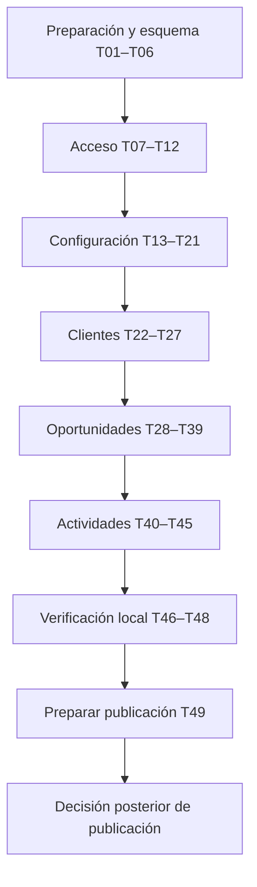

# Plan de implementación de la segunda entrega

Fecha: 08/10/2026. Estado: **plan aprobado explícitamente; planificación cerrada; implementación no iniciada**. El usuario aprobó primero la especificación y después este plan, solicitando cerrar esta etapa. El seguimiento único de ejecución está en [todo.md](todo.md); este documento explica orden, integración y verificación, sin duplicar checkboxes. No volver a solicitar aprobación del mismo plan al retomar su ejecución.

## 1. Resultado y fuentes

Entregar recorridos completos del CRM académico: administrador inicial, acceso por cookies, tres roles fijos, configuración comercial, clientes compartidos, oportunidades con permisos por responsable, funnel personal y actividades/historial. Probar lo fundamental localmente y preparar una publicación posterior para profesores. No hay porcentaje de cobertura, agenda, contabilidad, IA, sesiones persistentes ni nuevo sistema de permisos editables.

Fuentes vinculantes: [SPEC común](../docs/segunda-entrega/especificacion-tecnica.md), [acceso](../SPEC-acceso.md), [configuración](../SPEC-configuracion-comercial.md), [clientes](../SPEC-clientes.md), [oportunidades](../SPEC-oportunidades.md), [actividades](../SPEC-actividades.md), [diseño funcional](../docs/segunda-entrega/diseño-segunda-entrega.md), [decisiones confirmadas](../docs/segunda-entrega/decisiones-confirmadas.md), [CONSTRAINTS](../CONSTRAINTS.md) y [AGENTS](../AGENTS.md). Los PDF de `Enunciado/` conservan autoridad académica. No convertir detalles históricos de primera entrega en nuevos requisitos.

## 2. Punto de partida comprobado al planificar

- Hay controladores, servicios, DTO, modelos EF, un SQL inicial, cliente OpenAPI, formularios y vistas de empresas/contactos/oportunidades/funnel. Se conservan los proyectos y patrones actuales.
- Login valida BCrypt y devuelve un usuario; todavía no establece identidad autenticada en backend. Existen rutas antiguas que aceptan actor/estado/servicio desde el cliente. El acceso real es la primera capacidad a resolver.
- Falta `Embudo`; la etapa actual no tiene embudo/estado/activo. Oportunidad mantiene relaciones antiguas y hay entidades de líneas/log/actividad que deben retirarse. No es solo un cambio de nombres de endpoints.
- Actualmente `frontend/src/api/client.ts` usa `/api` y Vite lo reenvía a localhost:5169. La referencia histórica a tres tests fallidos por URL de Azure no es un nuevo resultado: se volverá a medir en T01.
- No hay proyecto de tests .NET ni inventario válido de vulnerabilidades. La suite frontend histórica demoró unos 178 segundos; no cabe completa en cada tarea.
- El árbol contiene reorganización documental y cambios locales de `appsettings.json` preexistentes. No incluirlos indiscriminadamente en commits ni leer secretos en salidas. No había `tasks/plan.md` ni `tasks/todo.md` al iniciar este plan.

No se ejecutaron builds, tests, API, Docker ni Azure para esta planificación.

## 3. Forma de avanzar

Trabajar por incrementos de una capacidad. Dentro de cada incremento se permiten tareas preparatorias de persistencia/API/UI pequeñas; el recorrido se considera entregado solo cuando sus partes funcionan juntas. No construir primero todo el backend y dejar toda la interfaz para el final. Las únicas bases compartidas anticipadas son entorno de pruebas, esquema SQL objetivo, identidad y contrato HTTP.

Cada tarea apunta a una sesión focalizada y aproximadamente 3–5 archivos; S indica 1–2. Los archivos citados son candidatos, no permiso para reescribir directorios enteros. Si al concretar una tarea requiere más de unos cinco archivos o dos horas, subdividirla en `Txx.a`, `Txx.b` antes de ejecutar y conservar criterios/dependencias del padre. Contar también pruebas, interfaces y archivos generados al revisar el alcance; no esconderlos para aparentar un cambio pequeño. La subdivisión rutinaria no requiere otra entrevista.

Los checkpoints cada dos o tres tareas son verificaciones del agente, no nuevas solicitudes de permiso. Presentar revisión humana cuando el incremento esté listo para integrar. La aprobación de este plan y el OK de cada merge son hitos distintos.

### Transición desde la primera entrega

1. Elaborar el SQL objetivo para una **base nueva separada**, sin migrar datos ni alterar la base de primera entrega. T04 prepara el esquema completo porque las restricciones cruzadas necesitan tablas destino; los mapeos y recorridos se adaptan después por módulo.
2. Mantener configuración local de desarrollo y de tests separadas, sin fallback remoto. Inicialización explícita y datos ficticios; nunca reconstruir una base al arrancar la aplicación.
3. En la rama del incremento, adaptar SQL/EF/contratos/consumidores coordinadamente. Los commits preparatorios pueden no habilitar aún una pantalla; no integrarlos individualmente si dejan un recorrido anunciado roto. Los GET/POST antiguos incompatibles quedan fuera del mapeo y de la navegación del entorno nuevo hasta ser sustituidos, sin respuestas ficticias ni endpoints que ignoren las reglas nuevas. T07 prepara ese corte; al cerrar cada módulo se elimina su superficie anterior.
4. Autenticación por defecto desde el primer recorrido operativo. Una ruta antigua no puede seguir abierta por comodidad. Los permisos específicos se prueban al habilitar cada recurso; no se presupone que autenticar basta para autorizar.
5. La primera instalación del entorno nuevo comienza por el administrador y configuración vacía. No simular producto terminado con servicios/embudos de demo sembrados automáticamente. Los fixtures de tests sí incluyen datos de ejemplo aislados.
6. Antes de integrar un incremento, demostrar sus recorridos y que los ya habilitados siguen funcionando. La primera entrega publicada permanece sin cambios. T46 comprueba que al completar la segunda entrega no subsiste código ni una segunda API obsoleta.

Esto evita crear migraciones comerciales, dos implementaciones permanentes o una infraestructura de feature flags para el trabajo práctico. Los controles de referencia de clientes/configuración usan la persistencia objetivo y fixtures de oportunidades antes de que exista su UI; luego se vuelven a comprobar con altas reales del módulo.

## 4. Orden y dependencias

| Bloque | Tareas | Resultado verificable / cierre |
|---|---|---|
| Preparación | T01–T03 | Línea de base actual, conexión segura y runner PostgreSQL aislado. |
| Esquema e inicialización | T04–T06 | Esquema nuevo validado; tres roles fijos y un único administrador. |
| Acceso HTTP | T07–T09 | Sesión protegida, CSRF y transporte del cliente; contratos comunes. |
| Acceso desde UI | T10–T12 | Login real y administración de usuarios; cierre de acceso. |
| Catálogos | T13–T15 | Configuración de catálogos por administrador y opciones para negocio. |
| Servicios | T16–T18 | Modelo embudo/etapa preparado y gestión de servicios. |
| Embudos y etapas | T19–T21 | Finales automáticas, orden, bajas/reapertura de configuración; cierre de configuración. |
| Empresas | T22–T24 | Alta, edición y consulta paginada compartida. |
| Contactos y bajas | T25–T27 | Relaciones históricas y bloqueos de clientes; cierre de clientes. |
| Alta de oportunidades | T28–T30 | Modelo definitivo, alta ligera e historial inicial atómico. |
| Consulta comercial | T31–T33 | Tabla compartida, detalle e historial de etapas; funnel propio del vendedor. |
| Gestión de abiertas | T34–T36 | Edición, reasignación y movimiento autorizados. |
| Cierre de oportunidades | T37–T39 | Ganar/perder, reabrir y baja; cierre de oportunidades. |
| Registro de actividades | T40–T42 | Interacciones reales con fechas, actor y contexto. |
| Historial comercial | T43–T45 | Edición/baja, cronología unificada en fichas; cierre de actividades. |
| Entrega local | T46–T48 | Retiro de legado, seguridad y ensayo integral. |
| Preparación de publicación | T49 | Guía operativa concreta; publicación aún pendiente de autorización. |

Dependencias exactas en cada tarea. El orden respeta acceso/roles antes de las operaciones comerciales; el mapa aprobado sitúa configuración antes de clientes para disponer de sus opciones. No obliga a aprobar cada catálogo por separado.

## 5. Verificación y definición de terminado

### Comandos reutilizados por las tareas

| Código | Comando / evidencia | Alcance |
|---|---|---|
| B | `dotnet build backend/FluencyAPI.slnx --no-restore -m:1` | Desde raíz, con dependencias restauradas. |
| F | `npm run build` y `npm run lint -- src vite.config.ts` | Desde `frontend`; tipos y build reales. |
| API(nombre) | `dotnet test backend/FluencyAPI.Tests/FluencyAPI.Tests.csproj --no-restore --filter "FullyQualifiedName~nombre"` | Proyecto y clases previstos, creados durante implementación. `nombre` se reemplaza por la clase de pruebas pertinente, no se copia literalmente. |
| UI(ruta) | `npm run test:run -- ruta` | Desde `frontend`; ruta concreta de tests existente o creada por esa tarea. Adaptar temporales solo si persiste el problema documentado. |
| D | `git diff --check` y revisión de modificaciones, nuevos y staged | Sin exponer configuraciones sensibles; comprobar no debilitamiento de constraints. |
| S | Auditoría npm raíz/frontend, auditoría .NET y escaneo redactado de secretos | Comandos y severidades en CONSTRAINTS; mecanismo reproducible en T01/T47. |

La tabla abrevia comandos, no sustituye evidencia. Al cerrar cada tarea registrar comando exacto, resultado, duración, archivos y límites. Los nombres de tests citados en todo.md son propuestas de ubicación/clase, no archivos ni checks que existan hoy. Regenerar `schema.d.ts` con `npm run api:types` cuando cambie el contrato, con API **local** disponible; nunca editarlo a mano ni conectar el generador a Azure por comodidad.

Por tarea ejecutar D, build de las capas modificadas y pruebas fundamentales afectadas. Procurar unos 90 segundos; un exceso se registra y se completa la comprobación, no se cancela para marcarla verde. No añadir tests por cambios puramente documentales. No repetir todos los checks cuando no hubo nuevos cambios ni dudas.

Por cierre de módulo: B + F, suite backend pertinente completa y suite frontend completa, tipos regenerados, revisión S según cambios y recorrido manual local con roles separados. Todas las pruebas son locales. Los fixtures deben usar PostgreSQL real para índices/rollback/concurrencia; mocks de UI no acreditan permisos de API. Sin configuración de tests, fallar explícitamente y registrar bloqueo operativo; no saltar la prueba ni sustituirla por InMemory.

Cada tarea se termina cuando cumple sus criterios, no incorpora fallos nuevos ni secretos/hallazgos altos-críticos nuevos, respeta los acuerdos y deja evidencia. Deuda previa se identifica por causa, no por cantidad de fallos. Controles imposibles de ejecutar quedan pendientes y no se presentan como aprobados. Una tarea preparada no equivale a una rama integrada ni a un despliegue autorizado.

### Cobertura fundamental y trazabilidad

| Regla | Tareas con evidencia principal |
|---|---|
| Admin único, roles fijos, identidad real, expiración/CSRF, cambios efectivos de usuario | T05–T12 |
| Etapa con sus siete campos; finales únicas, órdenes y bloqueos | T16, T19–T21 |
| Todos gestionan clientes; defaults, PATCH y relaciones históricas | T22–T27, T34, T43 |
| Solo propias se modifican; todas se leen; funnel propio | T29, T31–T39, T41–T45 |
| Alta mínima, cero válido, precio copiado, campos academia opcionales | T29–T30, T34 |
| Transición e historial atómicos; finales no eluden cierre | T28–T29, T36–T38 |
| Reasignación retira permiso; vendedor no reabre | T35, T38, T43 |
| Baja clientes ≠ baja embudo/etapa; sin cascadas ni restauración comercial | T19–T21, T27, T39, T43–T45 |
| Historia ordenada/paginada, doble fecha, autor de sesión | T31, T40–T45 |
| No regresión, seguridad, aislamiento de base y demostración integral | T01–T04, T46–T48 |

Elegir carreras representativas: dos finales del mismo tipo/órdenes duplicados (configuración); baja de cliente concurrente con asociación (clientes); cierre o reasignación concurrentes con mutación (oportunidades). Comprobar rollback y `409`, no todas las intercalaciones posibles. No sumar auditoría de campos ni métricas ajenas al alcance.

## 6. Git y continuidad

Base `segunda-entrega`; ramas por incremento, por ejemplo `segunda-entrega-acceso`, `segunda-entrega-configuracion`, `segunda-entrega-clientes`, `segunda-entrega-oportunidades` y `segunda-entrega-actividades`. Se pueden dividir más si facilita revisión. Commits autónomos pequeños. Antes del PR: actualizar la rama con la integración aceptada, repetir solo comprobaciones afectadas por conflictos/cambios y presentar evidencia. PR siempre hacia `segunda-entrega`; merge únicamente después del OK del usuario. No tocar `main` ni interpretar la aprobación del plan como aprobación de todos los merges.

No paralelizar escrituras que comparten DbContext, esquema, Program, cliente HTTP o tipos generados. Antes de cada tarea, leer su dependencia, `git status`, constraints y SPEC pertinente. Actualizar checklist y evidencia después, sin marcar por anticipado tareas bloqueadas o no verificadas.

### 6.1. Metodología de agentes acordada

Orquestador estable, implementador por incremento acotado y revisor independiente para cierres importantes. El implementador conserva continuidad entre tareas relacionadas; los checkpoints son verificaciones, no una obligación de crear otro agente. El orquestador coordina contratos/archivos compartidos, contrasta hallazgos y evidencia y presenta el incremento para el OK de merge.

| Responsabilidad | Modelo y razonamiento previstos |
|---|---|
| Orquestador | GPT-6.1 Sol, High |
| Implementación habitual | GPT-6.1 Sol, Medium |
| Autenticación, permisos, SQL y transacciones delicadas | GPT-6.1 Sol, High |
| Revisión independiente | GPT-6.1 Sol, High |
| Inventarios, exploraciones y cambios mecánicos acotados | GPT-6 Luna, Medium |
| Problema especialmente difícil que justifique escalar | GPT-6 Astra, High, de forma puntual |

Se autoriza esta delegación para la futura implementación. Cada encargo identifica objetivo/tareas, fuentes pertinentes, archivos asignados, criterios de aceptación, comprobaciones y límites. Pasar contexto específico suficiente, sin copiar toda la conversación por defecto. Si un modelo no está disponible, informar y usar una alternativa adecuada disponible; no afirmar cambios de modelo que no se hayan realizado.

Comenzar con un solo agente escribiendo código; paralelizar exploración/revisión cuando aporte valor. Dos implementadores simultáneos solo con contratos y archivos independientes. Coordinar también las escrituras y limpiezas de la base de tests. Ningún subagente se inicia durante este cierre documental.

## 7. Riesgos y pendientes operativos

| Riesgo / dato pendiente | Tratamiento y momento |
|---|---|
| Puerto, credenciales y bases del PostgreSQL dockerizado desconocidos | T02–T03 identifican destino local sin imprimir secretos; esta planificación no inspecciona ni arranca el contenedor. ID y autorización de uso futuro en AGENTS. |
| SQL nuevo ejecutado accidentalmente sobre la base anterior | T03–T04 exigen base de prueba/desarrollo nueva identificada. Verificar propiedad y host antes de limpiar fixtures. Base existente: solicitar autorización específica, nunca borrarla por inferencia. |
| Modelo nuevo incompatible con rutas anteriores | Corte coordinado por incremento; T07 impide exposición de rutas pendientes y T46 demuestra retiro final. No mantener bypass ni pruebas que ignoren el problema. |
| Cambios de roles/propiedad durante escritura | Actor actual, consultas transaccionales y carreras fundamentales desde T08/T11 y cada módulo. |
| Paquetes o scanner inaccesibles por restricciones de red | Registrar análisis pendiente; no declarar limpio ni instalar alternativas innecesarias. Preparar el resto y resolver antes del cierre correspondiente. |
| URLs distintas en Azure: CORS previo no acredita cookies | T49 documenta topología aún desconocida. Preferir mismo origen; aprovechar configuración existente si compatible. Alternativa propuesta: servir React compilado desde ASP.NET Core. No cambiar a JWT ni añadir servicios por anticipado. |
| Claves Data Protection y HTTPS del hosting | Configuración persistente y separada por entorno; resolver al preparar publicación, sin compartir secretos. |
| Tamaño real de una tarea supera estimación | Subdividir conservando resultado y checkpoints; no acumular un PR transversal por conveniencia. |

No hay decisiones funcionales pendientes para empezar a preparar el entorno local. Los datos operativos se obtienen cuando sean necesarios; solo consultar lo que no pueda inferirse con seguridad o implique base existente, alcance, merge o publicación. No realizar pruebas contra Azure. T49 prepara instrucciones y un escenario local equivalente, pero no ejecuta el despliegue.

## 8. Aprobación y cierre de planificación

El usuario aprobó expresamente el plan el 08/10/2026 y pidió cerrar la planificación. Quedan aprobados el orden, criterios de verificación y metodología descritos. Las 49 tareas y sus checkpoints permanecen pendientes; no se acredita trabajo implementado por esta aprobación.

La siguiente sesión de implementación comienza por T01–T03, salvo indicación distinta: línea de base actual y entorno de pruebas local seguro. No necesita repetir la aprobación de este plan. Se mantienen las decisiones específicas previas a merge, publicación o reconstrucción de una base existente. En este cierre solo se actualizó documentación.
